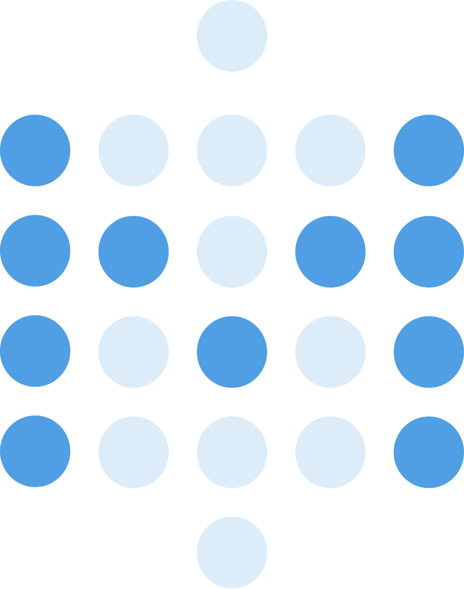

<div align="center">
  <br/>
</div>

<p align="center">
  <a href="https://join.slack.com/t/graicommunity/shared_invite/zt-1il70kfeb-TaCm5fwHg_quWCpKNYyj6w">
    
  </a>
   <a href="https://github.com/grai-io/grai-core">
    
  </a>
  <a href="https://github.com/grai-io/grai-core">
    
  </a>
  <a href="https://github.com/grai-io/grai-core">
    
  </a>
  <a href=https://www.ycombinator.com/launches/H8h-grai-open-source-version-control-for-metadata target='_blank'>
    
  </a>
</p>

<h3 align="center">
  <a href="https://docs.grai.io/"><b>Documentation</b></a> &bull;
  <a href="https://www.grai.io" title="Grai Homepage"> Website </a> &bull;
  <a href="https://join.slack.com/t/graicommunity/shared_invite/zt-1il70kfeb-TaCm5fwHg_quWCpKNYyj6w"><b>Slack</b></a> &bull;
  <a href="https://github.com/orgs/grai-io/discussions/" title="Community Page"> Discussion </a> &bull;
  <a href="https://calendly.com/grai-founders"><b>Want to Chat?</b></a>
</h3>


## Introduction

**Data lineage made simple.**
Grai makes it easy to understand and test how your data relates across databases, warehouses, APIs and dashboards.

- **Pre-built connectors.** Automatically synchronize lineage from across the stack so your metadata is never out of date.
- **Centralized data tests.** Write data validation tests which run whenever upstream data sources change.
- **Integrated with GitHub.** Run data validation tasks as part of your CI/CD process to test changes everywhere your data is used.
- **Your data, your cloud.** Grai is fully open sourced and self hosted. You maintain full control over your data and hosting environment.

## How it works

- Automatically build column level lineage spanning your warehouse and production services with connectors for `dbt`, `Snowflake`, `Fivetran` and more (see below).
- Get alerts in your CI/CD workflows whenever changes to a production system will impact your warehouse or dbt projects with [GitHub Actions](https://github.com/grai-io/grai-actions-server).
- Self host the project or run it in the [Grai Cloud](https://app.grai.io) for free.

## Community Roadmap

We want your input about what is important, for that, add your votes using the 👍 reaction:

    Top Feature Requests
    Documentation Requests
    Top Bugs
    Top Questions

### Connectors

|                                                                   | integration   | install                             |
|-------------------------------------------------------------------|---------------|-------------------------------------|
|  | Snowflake     | `pip install grai-source-snowflake` |
|   | BigQuery      | `pip install grai-source-bigquery`  |
|   | Redshift      | `pip install grai-source-redshift`  |
|   | Postgres      | `pip install grai-source-postgres`  |
|      | MySQL         | `pip install grai-source-mysql`     |
|      | SQL Server    | `pip install grai-source-mssql`     |
|        | dbt           | `pip install grai-source-dbt`       |
|   | Fivetran      | `pip install grai-source-fivetran`  |
|        | csv, parquet, feather | `pip install grai-source-flat-file` |
|   | Metabase      | `pip install grai-source-metabase`  |
|     | Looker (alpha) | `pip install grai-source-looker`    |


## Quickstart

You can find a full quickstart guide in the [documentation](https://docs.grai.io/quick-start) which covers deploying your own instance of Grai and getting set up with your first connector in python.
The fastest way to get started is through the Grai CLI but you can also run the project locally with docker compose.

Default login credentials:

```
username: null@grai.io
password: super_secret
```

### CLI

```bash
pip install grai-cli
grai demo start
```

### Running Locally

You can always find pre-built images of the backend server at `ghcr.io/grai-io/grai-core/grai-server:latest` and the frontend at `ghcr.io/grai-io/grai-core/grai-frontend:latest`, however, if you prefer to build from source, you can do so with docker compose.

```bash
git clone https://github.com/grai-io/grai-core
cp examples/deployment/docker-compose/docker-compose.yml
docker compose up
```

The backend server will be available at [http://localhost:8000/](http://localhost:8000/) and the frontend is now here [http://localhost:3000/](http://localhost:3000/).

After logging in and connecting a data source you'll be greeted with a lineage graph looking something like this


For more information about using the web application check out the [getting started guide](https://docs.grai.io/web-app/getting-started).

### Other Deployment Mechanisms

You can find example configurations for docker compose and Kubernetes in the [examples](/examples/deployment) folder.

#### Helm

We also publish a set of [Helm charts](https://charts.grai.io/) which are available if you prefer.

```
helm repo add grai https://charts.grai.io
helm install grai grai/grai
```

## Component Services

* [grai-server](https://github.com/grai-io/grai-core/tree/master/grai-server): The backend metadata service built on Postgres and Django as the Metadata persistence layer.
* [grai-frontend](https://github.com/grai-io/grai-core/tree/master/grai-frontend): The frontend web application built on React.
* [grai-cli](https://github.com/grai-io/grai-core/tree/master/grai-client): Python client library for interacting with the Grai server.
* [grai-schemas](https://github.com/grai-io/grai-core/tree/master/grai-schemas): The python metadata schema implementation library of Grai. It provides a standardized view of all Grai objects used to ensure compatibility between the server, integrations, and the client.
* [grai-graph](https://github.com/grai-io/grai-core/tree/master/grai-graph): A python utility library for working with the Grai metadata graph.
* [grai-actions](https://github.com/grai-io/grai-actions): A library of GitHub Actions implementations to integrate Grai tests into your CI/CD pipelines.
* [integrations](https://github.com/grai-io/grai-core/tree/master/grai-integrations): A collection of integration libraries to extract metadata and persist their results to Grai.


## Community Roadmap

Community Feedback drives our roadmap. Please let us know what you'd like to see next by asking questions and upvoting feature requests!

* [Feature Requests](https://github.com/orgs/grai-io/discussions/categories/feature-requests)
* [Documentation Requests](https://github.com/orgs/grai-io/discussions/categories/documentation-requests)
* [Bug Reports](https://github.com/grai-io/grai-core/issues)
* [FAQ](https://github.com/orgs/grai-io/discussions/categories/q-a)

## Repo Activity


## Community

Email us: founders@grai.io

Join us on Slack:  <a href="https://join.slack.com/t/graicommunity/shared_invite/zt-1il70kfeb-TaCm5fwHg_quWCpKNYyj6w"></a>

Check us out at www.grai.io

Sign up for our Newsletter `Grai Matters` [email list](https://blog.grai.io/#/portal/signup).

<a href="https://github.com/grai-io/grai-core/graphs/contributors">
  
</a>
