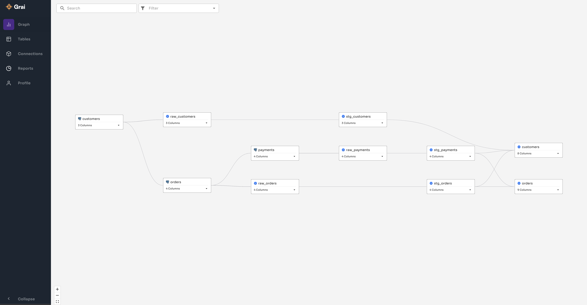

<div align="center">
  <br>
</div>

<p align="center">
  <a href="https://join.slack.com/t/graicommunity/shared_invite/zt-1il70kfeb-TaCm5fwHg_quWCpKNYyj6w">
    
  </a>
   <a href="https://github.com/grai-io/grai-core">
    
  </a>
  </a>
   <a href="https://github.com/grai-io/grai-core">
    
  </a>
  </a>
   <a href="https://github.com/grai-io/grai-core">
    
  </a>
  <a href=https://www.ycombinator.com/launches/H8h-grai-open-source-version-control-for-metadata target='_blank'>
    
   </a>
</p>

<p align="left">
  <a href="https://docs.grai.io/" title="Grai Documentation"> Docs </a> |
  <a href="https://www.grai.io" title="Grai Homepage"> Website </a>
</p>

## Introduction

**Data lineage made simple.**
Grai makes it easy to understand and test how your data relates across databases, warehouses, APIs and dashboards.

- **Pre-built connectors.** Automatically synchronize lineage from across the stack so your metadata is never out of date.
- **Centralized data tests.** Write data validation tests which run whenever upstream data sources change.
- **Integrated with GitHub.** Run data validation tasks as part of your CI/CD process to test changes everywhere your data is used.
- **Your data, your cloud.** Grai is fully open sourced and self hosted. You maintain full control over your data and hosting environment.

## How it works

- Automatically build column level lineage spanning your warehouse and production services with connectors for `dbt`, `Snowflake`, `Fivetran` and more (see below).
- Get alerts in your CI/CD workflows whenever changes to a production system will impact your warehouse or dbt projects with [GitHub Actions](https://github.com/grai-io/grai-actions-server).
- Self host the project or run it in the [Grai Cloud](https://app.grai.io) for free.

### Connectors

We currently support pre-built connectors for a variety of sources including

<center>

|                                                                    | connector  | install                             |
| ------------------------------------------------------------------ | ---------- | ----------------------------------- |
|  | Snowflake  | `pip install grai-source-snowflake` |
|   | BigQuery   | `pip install grai-source-bigquery`  |
|   | Postgres   | `pip install grai-source-postgres`  |
|      | MySQL      | `pip install grai-source-mysql`     |
|      | SQL Server | `pip install grai-source-mssql`     |
|        | dbt        | `pip install grai-source-dbt`       |
|   | Fivetran   | `pip install grai-source-fivetran`  |
|        | csv        | `pip install grai-source-flat-file` |

</center>

## Quickstart

You can find a full quickstart guide in the [documentation](https://docs.grai.io/quick-start) which covers deploying your own instance of Grai and getting set up with your first connector in python.

### Running Locally

You can always find pre-built images of the backend server at `ghcr.io/grai-io/grai-core/grai-server:latest` and the frontend at `ghcr.io/grai-io/grai-core/grai-frontend:latest`, however, if you prefer to build from source, you can do so with docker compose.

```
git clone https://github.com/grai-io/grai-core
cp examples/deployment/docker-compose/docker-compose.yml
docker compose up
```

The backend server will be available at [http://localhost:8000/](http://localhost:8000/) and the frontend is now here [http://localhost:3000/](http://localhost:3000/).

Default login credentials:

```
username: null@grai.io
password: super_secret
```

After logging in and connecting a data source you'll be greeted with a lineage graph looking something like this



For more information about using the web application check out the [getting started guide](https://docs.grai.io/web-app/getting-started).

### Other Deployment Mechanisms

You can find example configurations for docker compose and Kubernetes in the [examples](/examples/deployment) folder.

#### Helm

We also publish a set of [Helm charts](https://charts.grai.io/) which are available if you prefer.

```
helm repo add grai https://charts.grai.io
helm install grai grai/grai
```

## Other Features

### CLI Library

Programmatically interact with your data lineage from the command line using the grai-cli. Although we strongly encourage using something like `pipx`, for installing the cli it's otherwise as simple as

```
pip install grai-cli
```

After installation you can invoke the CLI with the command `grai`. The first time you run the CLI you should be greeted with installation instructions, but you can always rerun them with the command `grai config init`.

### Python Client Library

The client library provides programmatic access to the data lineage server. You can use the client library for any programmatic functionality you want to add on top of the core Grai installation.

```
pip install grai-client
```

To work with the client, learn more [here](https://docs.grai.io/tooling/client).

## Community

Come and join our [Slack](https://join.slack.com/t/graicommunity/shared_invite/zt-1il70kfeb-TaCm5fwHg_quWCpKNYyj6w)! We're on hand for support, help or just to hang out and chat.

To stay looped into updates, join our [email list](https://www.grai.io/signup/).
