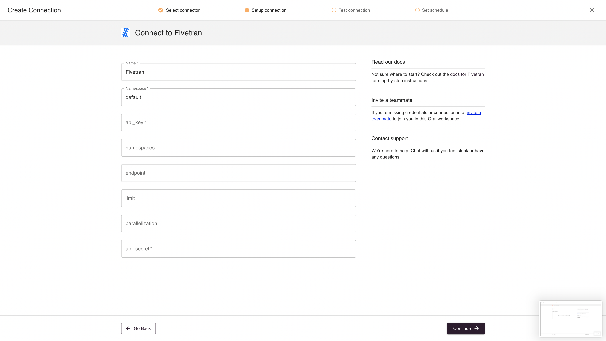

import { Callout } from "nextra-theme-docs";

# Fivetran

The Fivetran integration synchronizes your Fivetran connection metadata into the lineage graph.

## Web App



### Fields

| Field           | Value                                                                 | Example  |
| --------------- | --------------------------------------------------------------------- | -------- |
| Name            | Name for connection                                                   | Fivetran |
| Namespace       | Namespace for the connect, see [namespaces](/core/concepts/namespace) | default  |
| api_key         | Fivetran api key, see [api key](#apikey)                              |          |
| namespaces      | Optional                                                              |          |
| endpoint        | Optional endpoint if self-hosting fivetran                            |          |
| limit           | Limit the number of rows returned, optional                           | 10000    |
| parallelization | Run integration in parallel, optional                                 | 10       |
| api_secret      | Fivetran api secret, see [api key](#apikey)                           |          |

### ApiKey

Follow [https://fivetran.com/docs/rest-api/getting-started](https://fivetran.com/docs/rest-api/getting-started) to generate an api key.

## Python Library

### Installation

Install Fivetran Grai package with pip

```shell
pip install grai-source-fivetran
```

This installs the Grai fivetran integration, which is now ready to run in python

### Connecting & Syncing

The integration comes equipped with the client library already but we will need a python terminal or Jupyter Notebook to execute a few commands to establish a connection and begin querying the server.

Spin up your favorite python terminal then:

```python
import os
from grai_source_fivetran.base import update_server
```

For now we will use the default user credentials though you are free to create a new user / api keys from the server admin interface at http://localhost:8000/admin.

```python
client = ClientV1("localhost","8000")
client.set_authentication_headers("null@grai.io","super_secret")
```

Now we can update the server with data from your Fivetran source.
In order to do so you will need to pass credentials and namespace information for your various Fivetran connections.
If you wish to put all fivetran data into a single namespace you can provide a single `default_namespace` value or customize your
namespace organization by passing a dictionary to the `namespaces` parameter.

<Callout type="info" emoji="ℹ️">
    The `namespaces` dictionary should map fivetran connection id's to source and destination grai namespaces.
    e.g. `{[fivetran_connection_id]: {'source': [source_namespace], 'destination': [destination_namespace]}}`
</Callout>

Using example variables, in order to update the server with your metadata, simply run:

```python
update_server(client, default_namespace=[your_namespace], api_key=[your_fivetran_api_key], api_secret=[your_fivetran_api_secret])
```
