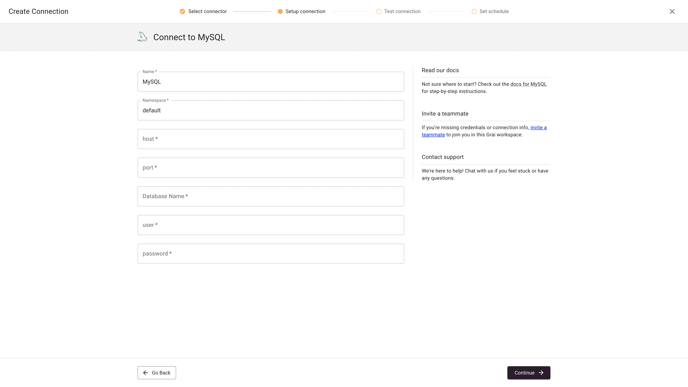

import { Callout } from "nextra-theme-docs";

# MySQL

The MySQL integration synchronizes metadata from your MySQL databases into the data lineage graph.

## Web App



### Fields

| Field         | Value                                                                 | Example                                                  |
| ------------- | --------------------------------------------------------------------- | -------------------------------------------------------- |
| Name          | Name for connection                                                   | Postgres                                                 |
| Namespace     | Namespace for the connect, see [namespaces](/core/concepts/namespace) | default                                                  |
| host          | Database host                                                         | sample-database.cudyk77thtpt.us-west-2.rds.amazonaws.com |
| port          | Database port                                                         | 5432                                                     |
| Database Name | Database Name                                                         | jaffle_shop                                              |
| user          | Database user                                                         |                                                          |
| password      | Database password                                                     |                                                          |

<Callout type="warning" emoji="ℹ️">
  Your database will need to be accessible from wherever you are running the
  Grai server. If you are using Grai Cloud your database will need to be
  accessible from the internet.
</Callout>

## Python Library

### Installation

Install MySQL Grai package with pip

```shell
pip install grai-source-mysql
```

This installs the Grai MySQL integration, which is now ready to run in python.

### Connecting & Syncing

The integration comes equipped with the client library already but we will need a python terminal or Jupyter Notebook to execute a few commands to establish a connection and begin querying the server.

Spin up your favorite python terminal then:

```python
import os
from grai_source_mysql.base import update_server
```

For now we will use the default user credentials though you are free to create a new user / api keys from the server admin interface at http://localhost:8000/admin.

```python
client = ClientV1("localhost","8000")
client.set_authentication_headers("null@grai.io","super_secret")
```

Now we can update the server with data from any mysql source. In order to do so you will need to pass credentials and namespace into the update_server function. Namespace is used to uniquely identify the nodes and when used consistently will allow you to add to the node from any source.

Using example variables, in order to update the server with your metadata, simply run:

```python
update_server(client, (client, dbname=[your_dbname], user=[your_db_username], password=[your_db_password], namespace=[your_grai_namespace], host=[your_db_host], port=[your_db_port]))
```
