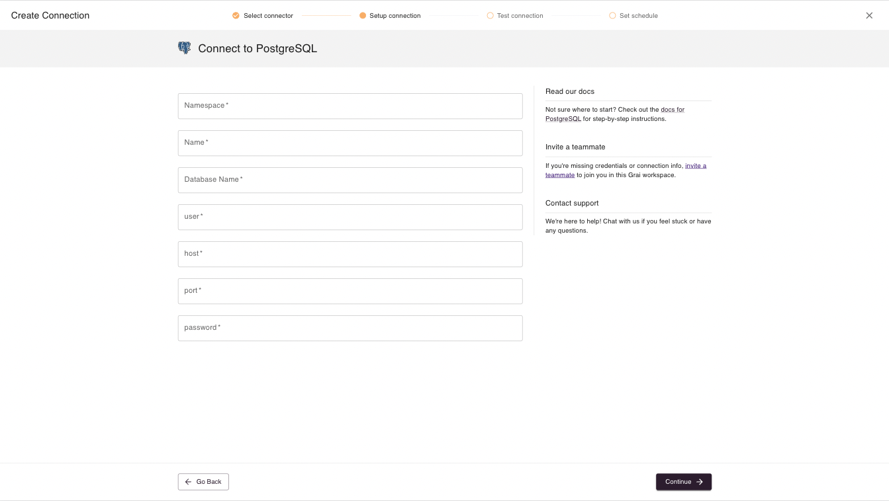
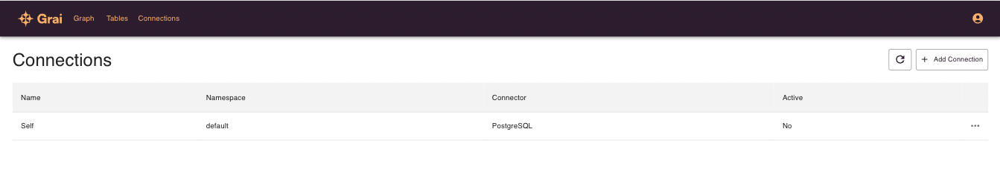
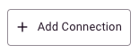
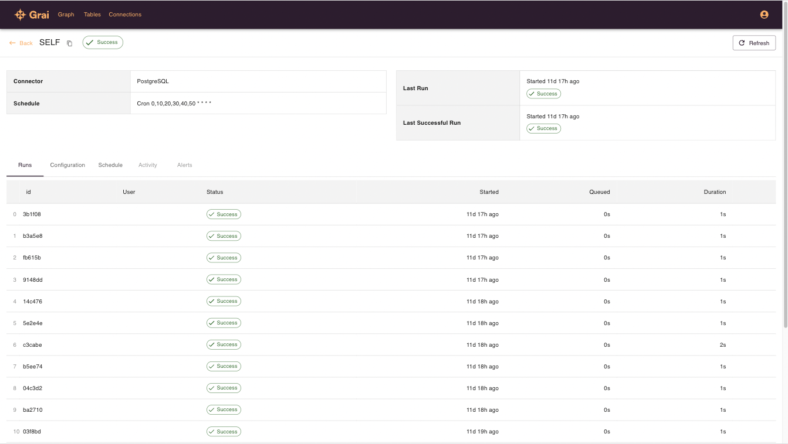
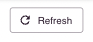
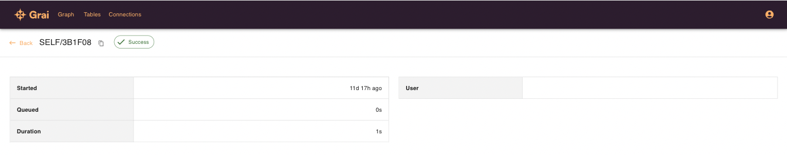
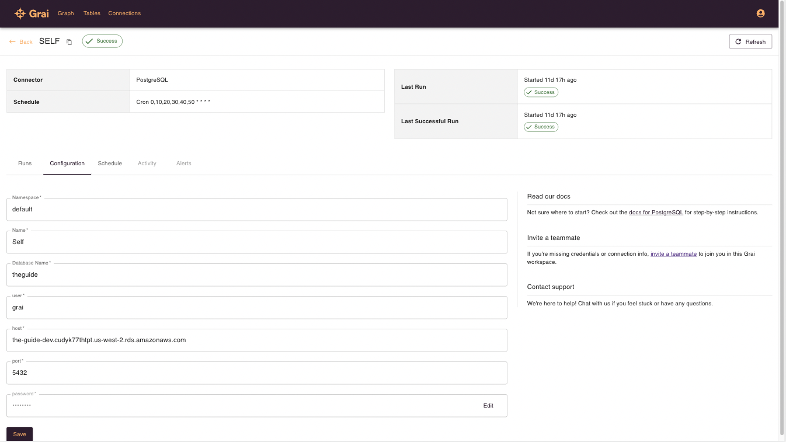
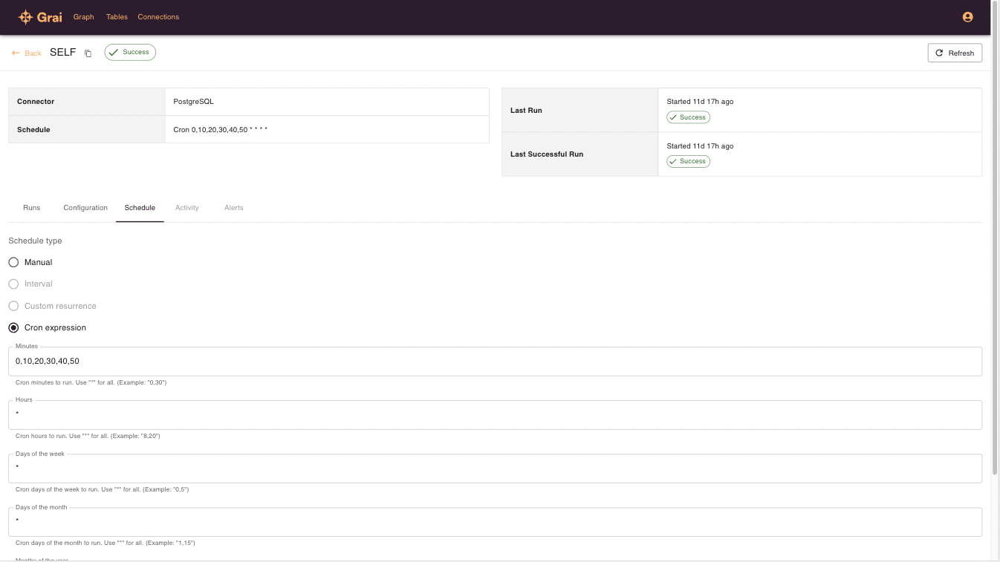

import { Callout } from 'nextra-theme-docs'

# Connections

Connections store the information needed to access data lineage from a particular data store or data tool using one of the pre-built integrations.

<Callout type="info" emoji="ℹ️">
    For the full list of web-app supported integrations see the [support status page](/integrations/support-status)
</Callout>

## The Connection Interface

Adding new connections is as simple as providing the connection credentials required for your data source.
Although the specific required credentials vary from source to source you can see an example of the Postgres interface below.

### Postgres

Next we will walk through everything you need to know to add new connections.

## View connections

Select connections from the top menu to view your existing connections.

## Add a connection

1. Go to Connections

2. Click Add Connection

3. Choose the connection type from the list of supported data sources

4. Enter a namespace, `default` is a good option if you don't know what to put here

5. Enter a name for your Connection

6. Enter the remaining required fields for the Connection

7. Save the Connection

8. Press Refresh on the Connection and wait for it to run

<Callout type="info" emoji="ℹ️">
    If the run errors you should be able to see the errors by clicking on the status or the table row.
</Callout>

9. Go to the Graph or Tables page to see your data

## Runs

Each time your conneciton is run, either manually or through a schedule, details are recorded, allowing you to see the status of the run and view any issues.

### Manually trigger a run

Click the refresh button to manually trigger a run which will refresh the data lineage with information from this particular connection.

### Run detail

Clicking on a run gives more detail, including any errors.

## Edit connection

A connection's configuration can be edited under the configuration tab.

## Edit schedule

A connection can be set to run on a fixed schedule or only manually. Edit the schedule under the schedule tab.

