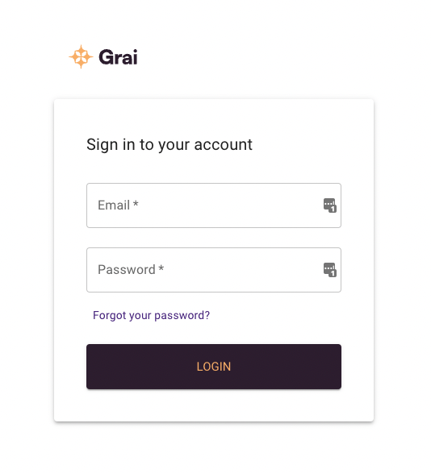

import { Callout } from "nextra-theme-docs";

# Getting Started

The Web App provides a convenient way to interact with the Grai server, allowing you to view you data lineage, connect to data sources, and capture updates.

When self-hosted it's viewable by default at [http://localhost:3000](http://localhost:3000) or through on the cloud at [https://app.grai.io](https://app.grai.io).

<Callout type="info" emoji="ℹ️">
  To install the Web App locally follow the instructions in
  [quickstart](/core/quick-start).
</Callout>

## Logging In

To get started you will need a username and password.
You should contact your administrator for a workspace invite..

<Callout type="info" emoji="ℹ️">
  If you installed Grai locally you should use the superuser you configured
  during installation. By default this be **null@grai.io** with the password
  **super_secret**
</Callout>

If you have forgotten your password, follow the link to reset it. This will only work on a local installation if you have [setup emails](/core/web-app/setup-emails).

<Callout type="info" emoji="ℹ️">
  Invited to a workspace but can't see any information? You may need to switch
  workspaces. From the profile menu (top right) choose Change Workspace.
</Callout>

## Creating your first connection

It is likely that when you login there will be no information in your database.
To get started we will connect your first data source and run an update to populate the database, this can then be repeated for each data source you wish to connect to Grai.

1. Go to Connections

2. Click Add Connection

3. Choose the Connector type from the list of supported data sources

4. Enter a namespace, `default` is a good option if you don't know what to put here

5. Enter a name for your Connection

6. Enter the remaining required fields for the Connection

7. Save the Connection

8. Press Refresh on the Connection and wait for it to run

<Callout type="info" emoji="ℹ️">
  If the run errors you should be able to see the errors by clicking on the
  status or the table row.
</Callout>

9. Go to the Graph or Tables page to see your data

## Inviting users

It is easy to share access to the Grai Web App, so that the whole team can understand your data lineage.

<Callout type="info" emoji="ℹ️">
  If installed locally, you need to have [setup
  emails](/core/web-app/setup-emails) to invite users through the Web App.
</Callout>

1. Go to Settings under the Profile Menu

2. Go to the Users page

3. Click Invite User

4. Enter the email address of the person you would like to invite

5. They will receive an email inviting them to join your Workspace
