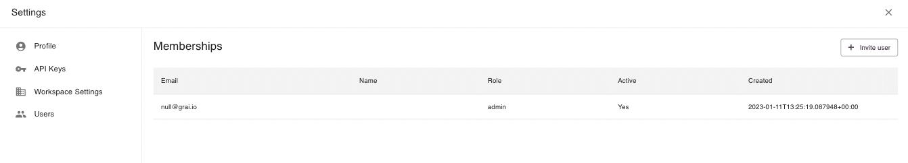

# Users

Grai server can work with multiple users, allowing your whole team to benifit from data lineage.

## View Users

Users can be viewed in settings.

## Invite User

1. Click Invite user on the users settings page.

2. Enter the email address for the user you would like to invite.

3. The user will receive an email inviting them to your workspace.
