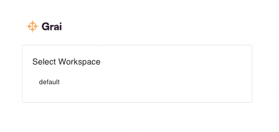

import { Callout } from "nextra-theme-docs";

# Workspaces

Grai server can work with multiple workspaces, for example you can have a demo workspace for trying things out.

## Change workspace

1. From the profile menu, top right, choose Change Workspace.

2. Select a workspace from the list.

<Callout type="info" emoji="ℹ️">
  If you can't see a workspace, you may need to ask your administrator for an
  invitation.
</Callout>

>
