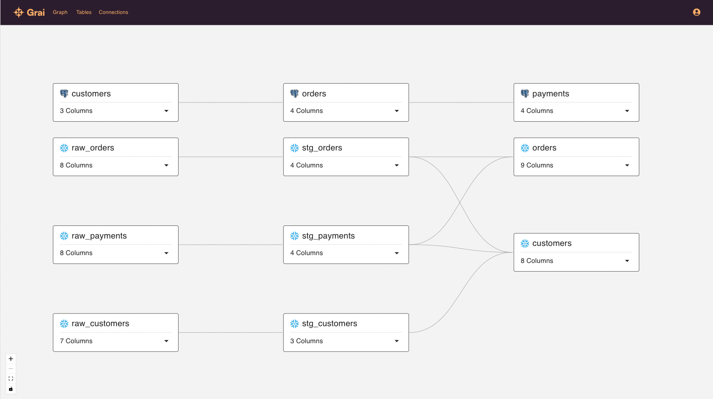

This guide will get you started with a data lineage graph based on a Postgres production database with the data being loaded into a Snowflake warehouse, where the data is transformed with dbt. We will then setup a Github action so that we check any changes when a pull request is opened.

> This guide is written based on using [Grai cloud](https://app.grai.io), however it should run equally well on your own implementation.

## Create a Snowflake connection

We will setup a Snowflake connection to import data lineage from Snowflake, our data warehouse.

1. Go to Connections

2. Click Add Connection


3. Choose the Snowflake connection


3. Enter the following values

> This guide uses test database credentials, so that you can easily follow along. Substitute your own credentials as needed.

| Field     | Value            |
| --------- | ---------------- |
| Namespace | default          |
| Name      | Snowflake        |
| account   | hujwihs-hab96881 |
| user      | demo             |
| role      | READ_ONLY        |
| warehouse | COMPUTE_WH       |
| database  | GRAI_SAMPLE      |
| schema    | PUBLIC           |
| password  | **************** |

> Notice the Namespace field, this is an important part of the Grai lineage strucutre. This is how you manage two connections pulling from the same source. For more details checkout the [Namespace](/tooling/namespace/) section.


4. Press Continue and Grai will run a check, if this fails you will need to go back and check your connection credentials.

5. For now we won't set a schedule for this connection. However you could set your connection to run every day, for example, to keep your data lineage up to date. Press Finish to complete the setup.

6. Once your new connection is created you should see the connection page. Press Refresh to run your connection and populate your data lineage graph.


The run will take a few seconds to run and then you should see the run complete successfully. If not you will need to check your connection parameters on the configuration tab.

7. Go to Graph. You should see a number of Snowflake tables with columns.


Currently, there are no connections between the tables, this is because dbt hasn't set up any foreign keys.

## Import dbt manifest

8. Go to Connections

9. Click Add Connection


10. Choose the dbt connection


11. Leave Namespace as default. Select the following dbt manifest file, this has been created by running `dbt compile` on the source repository https://github.com/grai-io/jaffle_shop_snowflake_demo.

[manifest.json](https://github.com/grai-io/jaffle_shop_snowflake_demo/blob/05752df033215c1b6b778f58abab8ba49a9feb52/files/manifest.json)

> Using "default" again for Namespace ensures the two connections pull onto the same group of names to make your metadata rich and complete.

12. Press Finish to upload the file. The run should take a few seconds and then complete successfully.

13. Go to Graph. You should now see that your Snowflake tables have been joined together based on the dbt metadata. For example where one dbt model depends on another Grai has created a link between the two tables.


## Create a Postgres connection

14. Go to Connections

15. Click Add Connection


16. Choose the Postgres connection


17. Enter the following values

| Field         | Value                                                    |
| ------------- | -------------------------------------------------------- |
| Namespace     | prod                                                     |
| Name          | Postgres                                                 |
| Database Name | jaffle_shop                                              |
| user          | demo                                                     |
| host          | sample-database.cudyk77thtpt.us-west-2.rds.amazonaws.com |
| port          | 5432                                                     |
| password      | zfYD%qW2VOfUmK1Y                                         |


18. Press Continue and Grai will run a check, if this fails you will need to go back and check your connection credentials.

19. For now we won't set a schedule for this connection. However you could set your connection to run every day, for example, to keep your data lineage up to date. Press Finish to complete the setup.

20. Once your new connection is created you should see the connection page. Press Refresh to run your connection and populate your data lineage graph.


The run will take a few seconds to run and then you should see the run complete successfully. If not you will need to check your connection parameters on the configuration tab.

21. Go to Graph. You should see a number of Postgres tables with columns.



There should be a number of connections between the Postgres tables, these have been produced from the foreign keys.

## Import edges

There won't be any links between the Postgres tables and the Snowflake ones. Typically, an ETL tool would be used to transfer data between the production database and the data warehouse. For our demo we will setup these edges using a manual file.

22. Go to Connections

23. Click Add Connection


24. Choose the YAML File connection


25. Leave Namespace as default. Select the following yaml file from the source repository https://github.com/grai-io/jaffle_shop_snowflake_demo.

[edges.yaml](https://github.com/grai-io/jaffle_shop_snowflake_demo/blob/05752df033215c1b6b778f58abab8ba49a9feb52/files/edges.yaml)

26. Press Finish to upload the file. The run should take a few seconds and then complete successfully.

27. Go to Graph. You should now see that your Postgres tables have been joined to some of your Snowflake tables. Amazing!


## Setup Github action

> You will need a Github repository for this stage. Forking the example repository might be a good starting point [jaffle_shop_snowflake_demo](https://github.com/grai-io/jaffle_shop_snowflake_demo).

28. Create a `.github/workflows directory` in your repository on GitHub if this directory does not already exist.

29. In the `.github/workflows` directory, create a file named `grai-actions-demo.yml`. For more information, see [Creating new files](https://docs.github.com/en/github/managing-files-in-a-repository/creating-new-files).

30. Copy the following YAML contents into the `grai-actions-demo.yml` file:

```
on: [pull_request]

jobs:
  test:
    name: Evaluate Postgres Changes
    runs-on: ubuntu-latest
    steps:
      - name: data lineage check
        uses: grai-io/grai-actions/postgres@master
        with:
          namespace: "prod"
          workspace: [WORKSPACE_UUID]
          client-host: "api.grai.io"
          api-key: [API_KEY]
          grai-frontend-host: "https://app.grai.io"
          db-host: sample-database.cudyk77thtpt.us-west-2.rds.amazonaws.com
          db-user: postgres
          db-password: jnicGnmRdXclhURSRr86
          db-database-name: jaffle_shop_dev
```

You will need to set the `workspace` and `api-key` parameters.

31. To generate an Api Key, on the Web App, navigate to Settings from the Profile Menu top right and then select API Keys. Press Add API Key and choose a suitable name, for example `demo`, then press Save.


You should record the returned key, as it will not be displayed again. This can be copied into the `[API_KEY]` slot in the `grai-actions-demo.yml` file. In production you should use a Github action secret to store this value, so that it isn't checked into source control, see [Encrypted secrets](https://docs.github.com/en/actions/security-guides/encrypted-secrets).

32. Your `Workspace UUID` can be seen at the top of the API keys page. Copy this value into your `grai-actions-demo.yml` file.

33. To see the action run you will need to create a pull request in Github. Once the action has run, if you have used the demo database credentials, you should see a number of comments on your PR showing some test failures. You can click on the link to view more details on the Web App.


