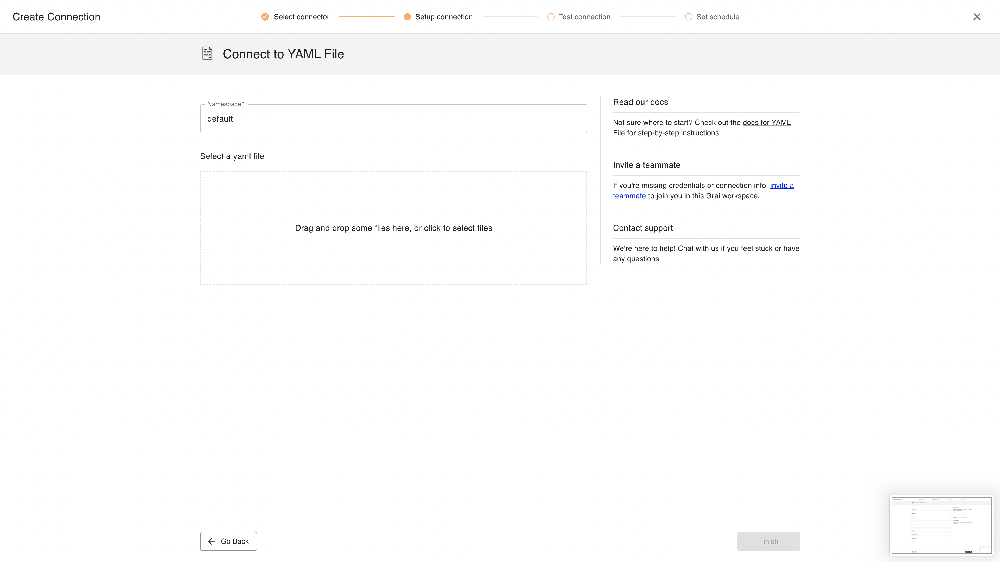

Every aspect of Grai can be serialized to yaml.
This allows you to manage your entire data lineage as code, backup your lineage in version control, or create and edit nodes/edges in code.


## Web App

The YAML File integration is used to upload a single YAML file, which needs to have the correct Grai format.



### Fields

| Field     | Value                                                           | Example |
| --------- | --------------------------------------------------------------- | ------- |
| Namespace | Namespace for the connect, see [namespace](/concepts/namespace) | default |


## CLI

You can create, edit, and delete lineage in yaml through the CLI.
Let's say you wanted to add an `is_really_important` flag to the metadata on the `customer_id` column of the `customers` table.
In that case we might write a yaml definition like this


```yaml
type: Node
version: v1
spec:
    name: "customers.customer_id"
    namespace: default
    is_active: true
    data_source: postgres
    display_name: "Customer ID"
    metadata:
        is_really_important: true
```

We could then update the server with this new information through the CLI

```shell
grai apply <node_file>
```
