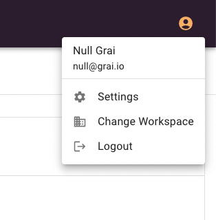

Grai server can work with multiple workspaces, for example you can have a demo workspace for trying things out.

## Change workspace

1. From the profile menu, top right, choose Change Workspace.

2. Select a workspace from the list.

> If you can't see the workspace you need talk to your administrator who may need to invite you.
